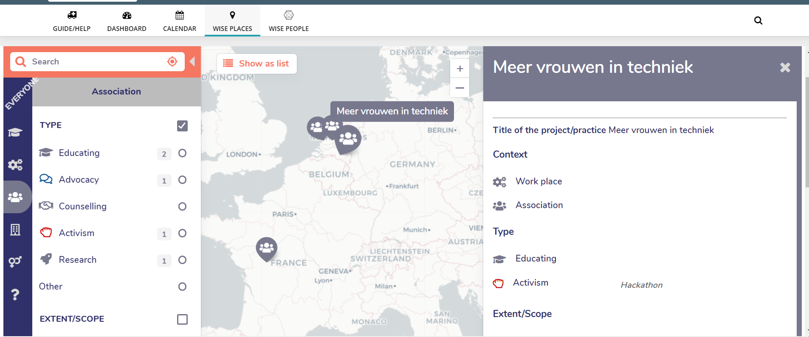
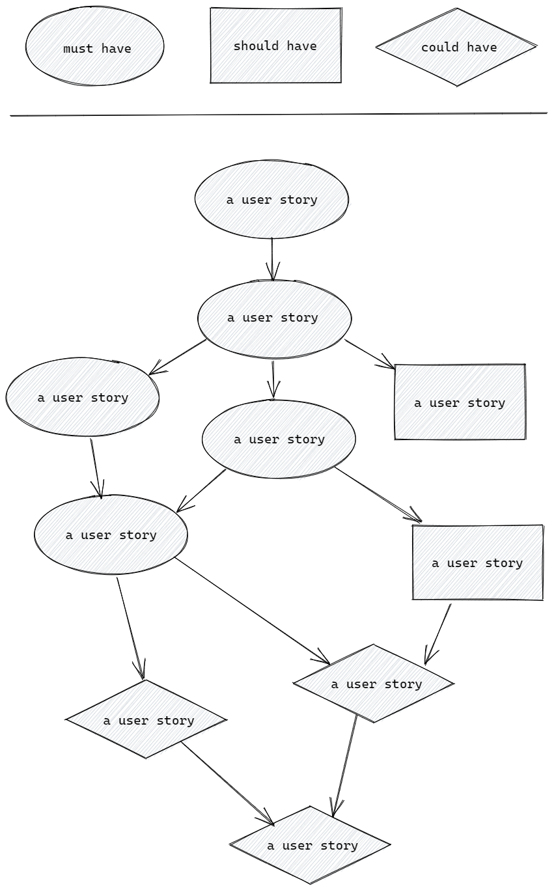

# Bridges hackathon

## Organization

BRIDGES aims at designing, implementing and evaluating Open STEM Ecosystems based on innovative approaches to recognition and accreditation to improve gender equity in the access to STEM education and careers BRIDGES will:

1. Create the conditions for the increased participation of girls and women in STEM education and careers
2. Bridge informal and formal STEM education and practices for future and actual female scientists

 ## The hackathon  

In today's hackathon, we want you to create a  product prototype based on specific topic ideas using Agile Development methodology.


<details><summary>Topics </summary>

1. ### Map visualisation to show companies nearby that obtained certain badges

Using the badges system from bridges,create an app that shows companies near by you who obtained the badges.

[Here](https://miro.com/app/board/o9J_lrndMHs=/?invite_link_id=504410750028) you can find the struture of the Badges

see the example below : 


2. ### Interactive questionnaire that presents you with situations and asks you how you would react/ analyse the company culture 

With this app, companies/individuals can obtain badges based on the answers they have given. these games can be played anywhere, in person or virtually, using any device with an internet connection.

Example : kahoot

3. ### A platform to grant badges to others based on recommendations

 With this app, a User can nominate a company/individual based on their contribution to increase participation of girls and women in STEM education and careers. 

4. ### Gamification platform (intended for children- and young people)

Today kids are very much into gaming so the best we can do is to implement play and learning together in one app.
Young minds can be influenced to understand that we are all different and we need to accept everyone and treat people with equality. A game that has focus on rewards like badges that they can earn for perhaps recognizing how to treat a certain situation.
Earn enough badges and it opens up a new part of the game so they will strive to do their best.

</details>

<details><summary>Sprints</summary>

### Sprint-1 : Discuss the topic

Based on the topics you have selected,

- Discuss and develop a concrete an idea
- Talk over the what the feature would look like

When planning always keep the user in mind, here's a few helpful questions to guide your group:

- Who is this product for?
- Why are they using  it?

### Sprint-2 : Write User Personas

 Think about who would want to use this web page and why. Describe these users by writing User Personas.

### Sprint-3:Write a Prioritized Backlog (user-stories)

Break down the website into user stories prioritized by must-have, should-have and could-have. Be sure to use the "as a ... I want to ... so that ..." format, and to include acceptance criteria for each user story.

### Sprint-4 : sequence your stories

The user stories in your Backlog are sorted by priority, but not written in any particular order. Some user stories depend on each other, some do not. Figuring out these relationships will make it easy to go from a unsorted backlog to a structured  strategy.


### Sprint-5 design your prototype (figma)

</details>

<details><summary>Deliverables</summary>

By the end of the hakathon each group will be asked to present their project. After all the presentations are submitted, The judges will pick the winners.

Each Group has to create a PR request to this repository containing the following documents.


```
- [] backlog 
- [] story-sequencing
- [] user-persona 
- [] figma design 

```
The selected projects, with the help of stakeholders,  will be designed and deployed live. Each participant/group member will be mentioned on the project and will be given the right recognition on their contribution.

</details>
